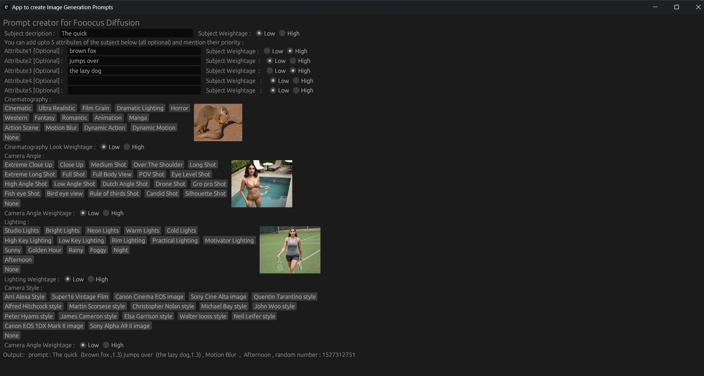

# diffusionpromptgen

diffusionpromptgen is a tool to generate prompts for image diffusion, in particular SDXL/Foocus .
Make sure you go to style menu of foocus and deactivate all styles before you use prompts from here. Works well with foocus, but you can use it for other models like Sana also.

## Usage
 - Double click the binary to open the GUI / cargo build to create binary if its not available for your platform
 - Add different attributes you want to prompt for
 - Select different other cinematic styles and other magic words SDXL recognises
 - Copy the final prompt from the output area at teh bottom of the window [don't copy the rabdom number part, that's just in case you want to save different seeds]

